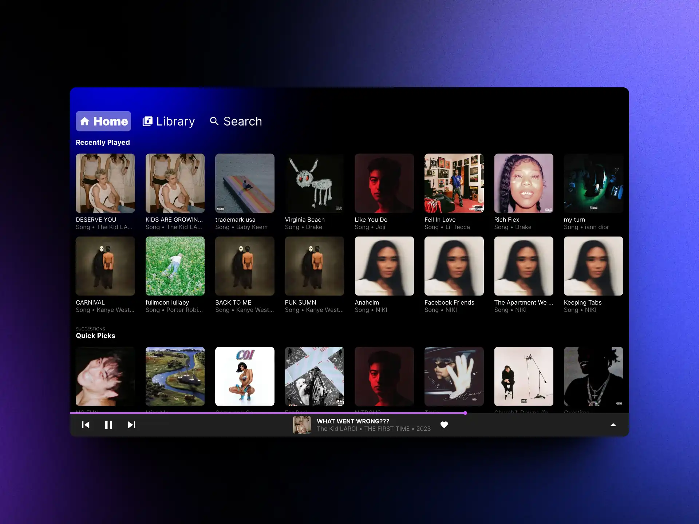
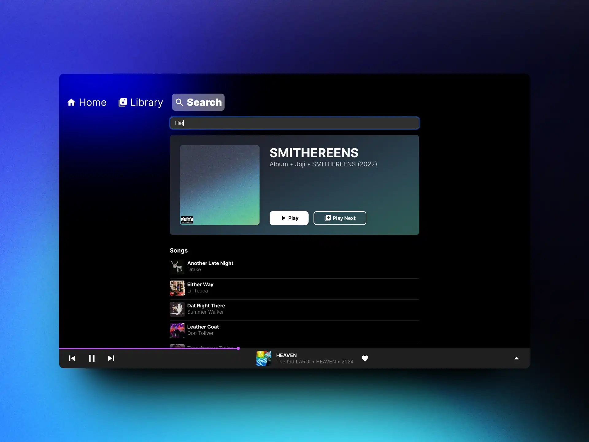
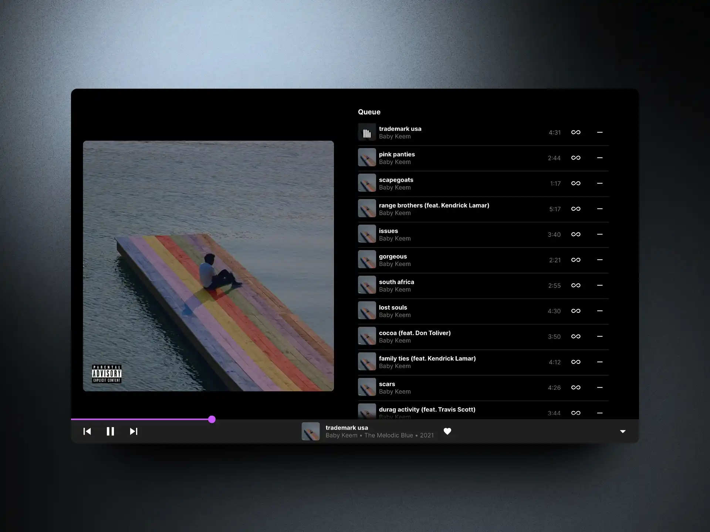

# kyoku - Desktop Music Player for Jellyfin

'kyoku' - A Japanese word for "piece of music."

Kyoku is lightweight and stunning with a familiar UI inspired by YouTube Music. It's cross-platform, so you can enjoy your music in style on Windows, Mac and Linux.

## Screenshots

## Features

- Find something to listen to quickly with Home
  - Quick pick suggestions based on listening history
  - Recently played tracks
  - Curated albums from your library
- Browse through your library
- Search songs, albums and artists
- OS media integration
- Instant mixes
